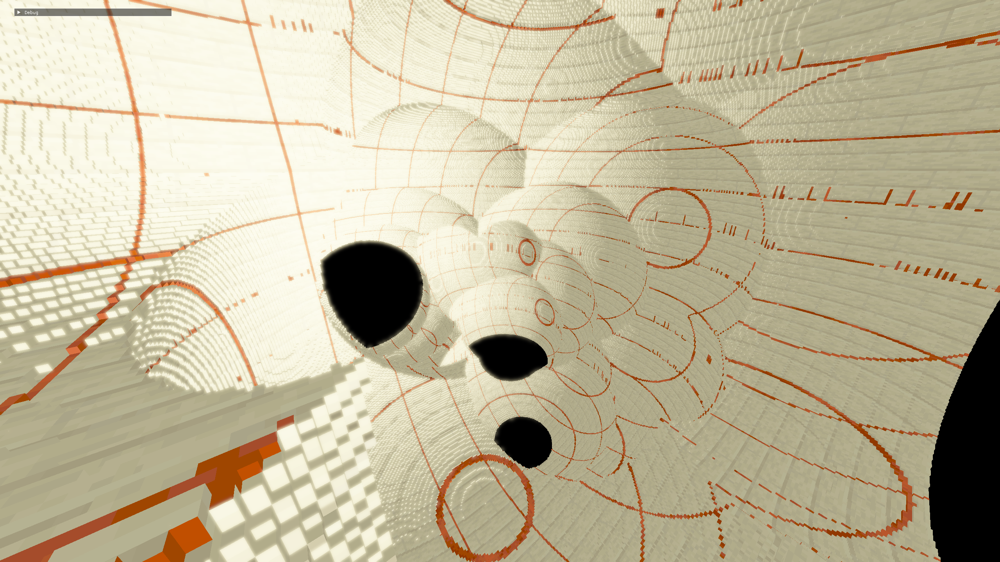

## Voxel Engine

## Features

- Binary greedy meshing
- Vertex pulling
- Occlusion culling
- CPU-side backface culling
- 1 byte per quad
- HDR and color correction
- Naive bloom implementation

## TODO

- Represent world in a tree
- Add LOD
